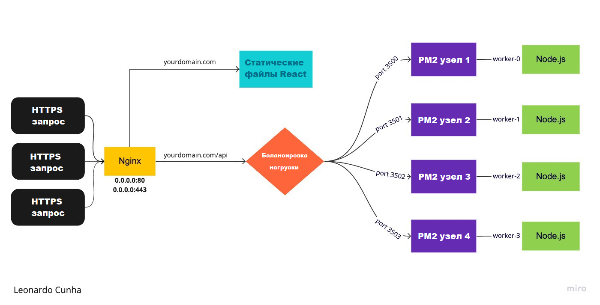

<h1>Развертывание приложения написанного на React и Node.js на сервере с помощью PM2 и Nginx</h1>
Цель этой статьи — задокументировать мой путь по процессу развертывания Frontend и Backend на одном компьютере с Linux (вместе с балансировщиком нагрузки).
Оригинальная статья на английском языке [здесь](https://medium.com/geekculture/deploying-a-react-app-and-a-node-js-server-on-a-single-machine-with-pm2-and-nginx-15f17251ee74)

<h2 style="backgroud-color: #BFEBED">Установка необходимых компонентов</h2>
Обратите внимание, что эти инструкции действительны для Ubuntu 16 или более поздней версии.

<h2>Node.js</h2>
Установим nodejs:

```
sudo apt install nodejs
```

Проверим что установка nodejs прошла успешно:
```
node --version
```
<h2>Nginx (веб-сервер, обратный прокси и балансировка нагрузки)</h2>

Обновим все пакеты/программы Ubuntu
```
sudo apt-get update
```

Установим Nginx:
```
sudo apt-get install nginx
```

Проверим что установка Nginx прошла успешно:
```
sudo nginx -v
```

Запустим Nginx:
```
sudo nginx
```

Убедимся, что Nginx запущен и работает:
```
curl -I 127.0.0.1
```

<h2>NPM (пакетный менеджер Node.js)</h2>

Установим NPM:
```
sudo apt install npm
```

Проверим что установка NPM прошла успешно:
```
npm -v
```
<h2>PM2 (менеджер процессов для Nodejs)</h2>

Установим PM2:
```
npm install pm2@latest -g
```

Проверим что установка PM2 прошла успешно:
```
pm2 -v
```

<h2>Certbot (клиент, который получает бесплатный сертификат SSL от Let’s Encrypt)</h2>
Убедимся, что версия snapd обновлена:

```
sudo snap install core; sudo snap refresh core
```
Если snapd не установлен, тогда устанавливаем:
```
sudo apt install snapd
```
Установим Certbot:
```
sudo snap install --classic certbot
```

Подготовим Certbot к работе:
```
sudo ln -s /snap/bin/certbot /usr/bin/certbot
```
<h2>Как это должно работать???</h2>
<figure class="sign">
  <p></p>
  <figcaption><i>Блок-схема развертывания Frontend и Backend на одном сервере</i></figcaption>
</figure><br><br>
    
Nginx будет обслуживать наши файлы сборки React и помогать балансировать нагрузку нашего серверного приложения через наши экземпляры PM2 Node.js. Количество экземпляров Node.js прямо пропорционально количеству ядер вашего процессора. Чтобы проверить, сколько ядер у вашего процессора Linux, просто выполните следующую команду:
```
nproc
```
В моём случае у сервера одно ядро, следовательно мы сможем обрабатывать лишь один экземпляр Node.js, работающим с PM2.
В оригинальной статье у автора 4 ядра поэтому кому интересна балансировка нагрузки вам [сюда](https://medium.com/geekculture/deploying-a-react-app-and-a-node-js-server-on-a-single-machine-with-pm2-and-nginx-15f17251ee74).


